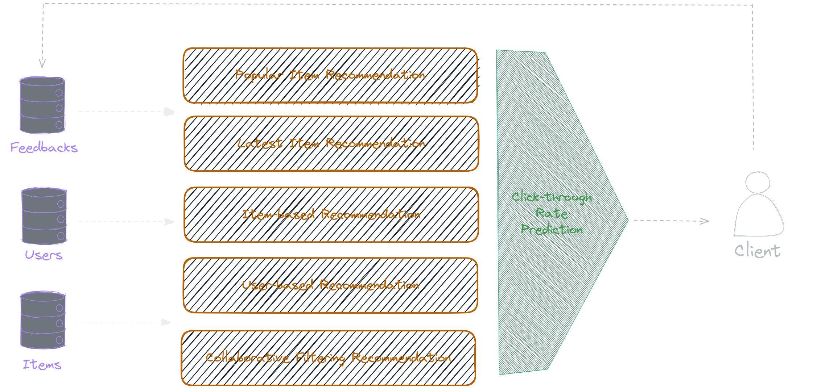

# Gorse Recommender System Essential
Hệ thống gợi ý (Recommender System) là một dạng hệ thống hỗ trợ ra quyết định, cung cấp giải pháp mang tính cá nhân hóa. Hệ thống dựa vào các tương tác của người dùng đến các vật phẩm, để dự đoán
"sở thích" người dùng trong tương lai và thực hiện đề xuất các ngội dung tương tự. Để một hệ thống hoạt động tốt, điều tiên quyết là phụ thuộc vào sự tương tác của người dùng, chẳng hạn như đánh
giá sao, bình luận tích cực, số lần click chuột vào sản phẩm, thời gian quan sát sản phẩm, v.v. 

Gorse là một hệ thống đề xuất mã nguồn mở được viết bằng Go. Gorse đặt mục tiêu trở thành một hệ thống mã nguồn mở phổ biến có thể dễ dàng đưa vào nhiều dịch vụ trực tuyến. Bằng cách nhập các item,
user và các dữ liệu tương tác được đưa vào Gorse, hệ thống sẽ tự động đào tạo các model để tạo đề xuất cho từng người dùng. Các tính năng của hệ thống như sau:

## Các đối tượng dữ liệu (Data Objects)

### User
User là đối tượng người dùng, chứa 2 field chính:
- `UserId` (string): Mã định danh duy nhất của người dùng, không thể chứa ký tự "/" vì gây xung đột với định nghĩa URL của RESTful API.
- `Labels` ([]string)

### Item
